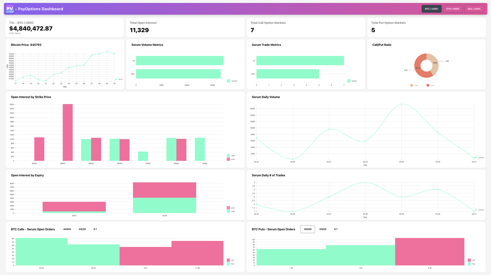

# PsyOptions Data Dashboard

Digestible data around options activity on Solana is pretty inaccessible at the moment. PsyViz provides a clean and user-friendly dashboard displaying some of the most important options-related data based on PsyOptions markets and Serum orderbooks.

A weekend project by [Aletna](https://github.com/aletna) and I. Started out as an anon project but now uploading it to my main Github.



## How we built it

- TypeScript, React and Tailwind / DaisyUI for the front-end
- D3 and Nivo for the data visualizations
- PsyOptions program to query all on-chain option market data
- Serum program to query corresponding on-chain order book data
- Aleph GraphQL API to query serum volume and trade history
- SPL-Token program to query account info and program accounts
- SPL-token-library for token metadata
- Option Markets:
  - We initially fetch and parse all PsyOptions Marketsby invoking the PsyOptions program, and filter them by non-expired expiration date and the three main pairs(BTC/USDC, soETH/USDC and SOL/USDC - excluding stSOL and mSOL)
    - We also determine whether a given option market represents a Call or Put market by inspecting the respective quote and underlying asset mints.
  - Open Interest:
    - Using the **Option Mint Key** from each option Market of each of the chosen pair, we call the **spl-token-program** to get the current circulation and amount of holders, representing the open interest per market
    - Sum all option market open interests per pair up to get the total open interest of a given pair (e.g. at the time of writing this there were 19 unique BTC/USDC markets)
      - there are markets of different strike prices, expiration dates and contract sizes
      - while markets may have the same strike price, expiration date and contract size, multiple may exist from different parties
- Serum Markets:
  - Each option market may have a Serum orderbook initialized. We check whether a **PDA** derived from the **Option Market Key and Price Currency Key** already exists, and if so we fetch that market data using the **Serum DEX program**.
  - Serum Volume Data:
    - The serum volume and trade historic data was queried via the Aleph GraphQL API, using the previously derived serum market key as an input.
  - Serum Orderbook Data:
    - For each Option Market that has an initialized Serum market, we load the ask and bid public keys via the Serum SDK and use those to query the corresponding orderbook data via the Serum DEX program. This information is then displayed filtered by
      - Call or Put Market
      - Strike Price
      - Expiration Date
      - Contract Size

## Some challenges 

Hitting request limits for the API, filtering the right data as well as modifying and cleaning the data into a usable format. Shoutout to the PsyOptions and Serum discord servers for being major sources of support during the hackathon!

## Run

```
yarn start
```

or

```
npm run start
```

## License

MIT
